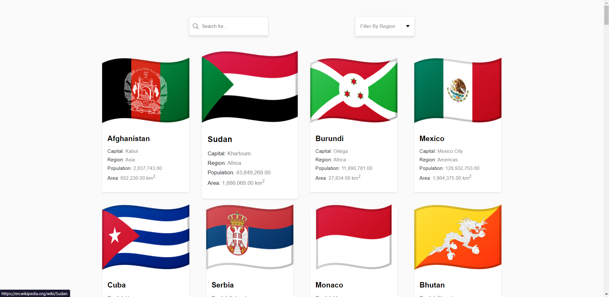

# ReactJs Search App

This is a test project, where I tried to use good practices in order to consume an API to show information about countries in the world.

## Screen

In this application we can search country by name and filter countries by region.

## References
Inpired in [React Components – How to Create a Search, Filter, and Pagination Component in React](https://www.freecodecamp.org/news/how-to-react-components/).

Using country API from [CountryAPI.io]](https://countryapi.io/documentation)
