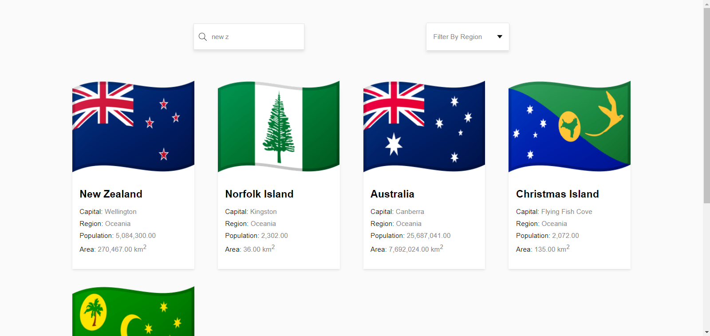
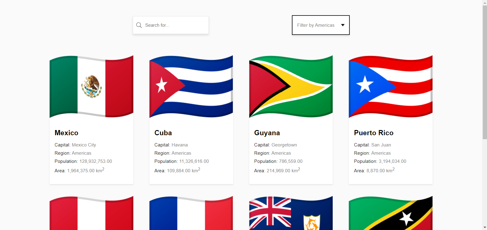

# ReactJs Search App

This is a test project, where I tried to use good practices in order to consume an API to show information about countries in the world. 

It will implement unit testing with jest and testing-library

## Screens




In this application we'll be able to search country by name and filter countries by region. In addition, we can go to the wikipedia page for more information about each country.

## How to start it up?
**Install dependencies**
```bash
npm install
```

Create an account in [CountryAPI login](https://countryapi.io/login) and generate API key, with free plan we get 100000 request.

**Add constants file (const.js) on src folder**
```bash
export const WIKI_INFO_URL_BASE = 'https://en.wikipedia.org/wiki/';
export const COUNTRY_API_URL_BASE = 'https://countryapi.io/api';
export const API_KEY = '-- with your token --';
```

**Run project**
```bash
npm run start
```

## References
Inpired in [React Components – How to Create a Search, Filter, and Pagination Component in React](https://www.freecodecamp.org/news/how-to-react-components/).

Using country API from [CountryAPI.io](https://countryapi.io/documentation)

Official documentation of [Jest](https://jestjs.io/docs/getting-started) and [Testing-Library](https://testing-library.com/docs/)